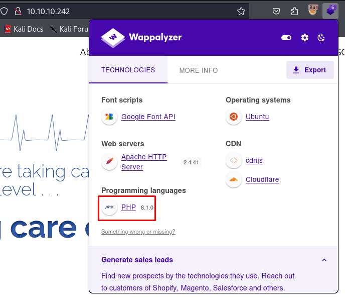
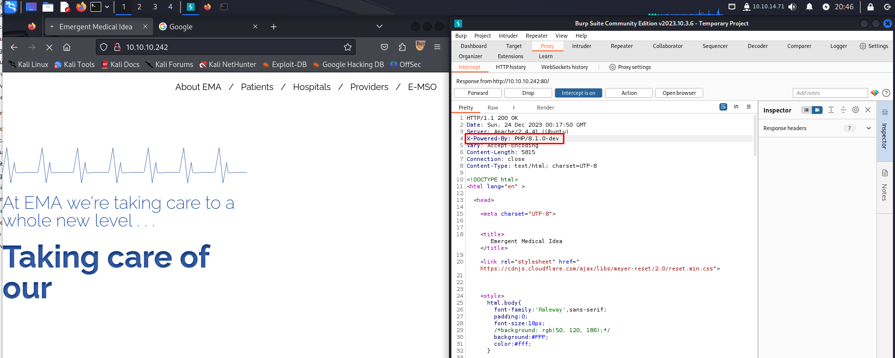
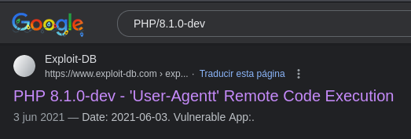
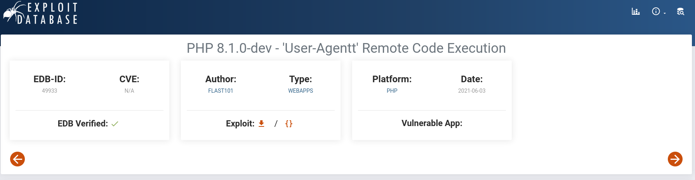

Delivery is a quick and fun easy box where we have to create a MatterMost account and validate it by using automatic email accounts created by the OsTicket application. The admins on this platform have very poor security practices and put plaintext credentials in MatterMost. Once we get the initial shell with the creds from MatterMost we'll poke around MySQL and get a root password bcrypt hash. Using a hint left in the MatterMost channel about the password being a variation of PleaseSubscribe!, we'll use hashcat combined with rules to crack the password then get the root shell.


## Portscan

The scan show that we have port 22 and port 80 open with an apache  web server 

```
Starting Nmap 7.94SVN ( https://nmap.org ) at 2023-12-23 19:04 EST
Nmap scan report for 10.10.10.242
Host is up (0.16s latency).
Not shown: 998 closed tcp ports (conn-refused)
PORT   STATE SERVICE VERSION
22/tcp open  ssh     OpenSSH 8.2p1 Ubuntu 4ubuntu0.2 (Ubuntu Linux; protocol 2.0)
| ssh-hostkey: 
|   3072 be:54:9c:a3:67:c3:15:c3:64:71:7f:6a:53:4a:4c:21 (RSA)
|   256 bf:8a:3f:d4:06:e9:2e:87:4e:c9:7e:ab:22:0e:c0:ee (ECDSA)
|_  256 1a:de:a1:cc:37:ce:53:bb:1b:fb:2b:0b:ad:b3:f6:84 (ED25519)
80/tcp open  http    Apache httpd 2.4.41 ((Ubuntu))
|_http-title:  Emergent Medical Idea
|_http-server-header: Apache/2.4.41 (Ubuntu)
Service Info: OS: Linux; CPE: cpe:/o:linux:linux_kernel

Service detection performed. Please report any incorrect results at https://nmap.org/submit/ .
Nmap done: 1 IP address (1 host up) scanned in 32.23 seconds

                                                        
```

## Website

I found using wappalyzer that the website is using PHP version 8.1.0



I re-checked the headers with burpsuite and discovered that the page was using this specific version PHP 8.1.0-dev. 




Doing some research we know that this PHP version was released with a backdoor. This version let you execute code by sending the User-Agentt header. 





## Exploit

Using the script i´ve found in exploitdb i´ve got an non stable shell in the server. 

```
Enter the full host url:
http://10.10.10.242/

Interactive shell is opened on http://10.10.10.242/ 
Can't acces tty; job crontol turned off.
$ ls    
bin
boot
cdrom
dev
etc
home
lib
lib32
lib64
libx32
lost+found
media
mnt
opt
proc
root
run
sbin
snap
srv
sys
tmp
usr
var

```


