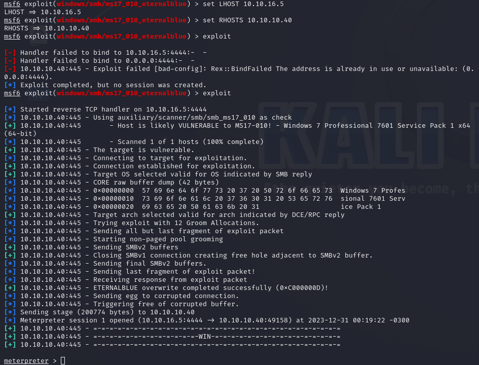
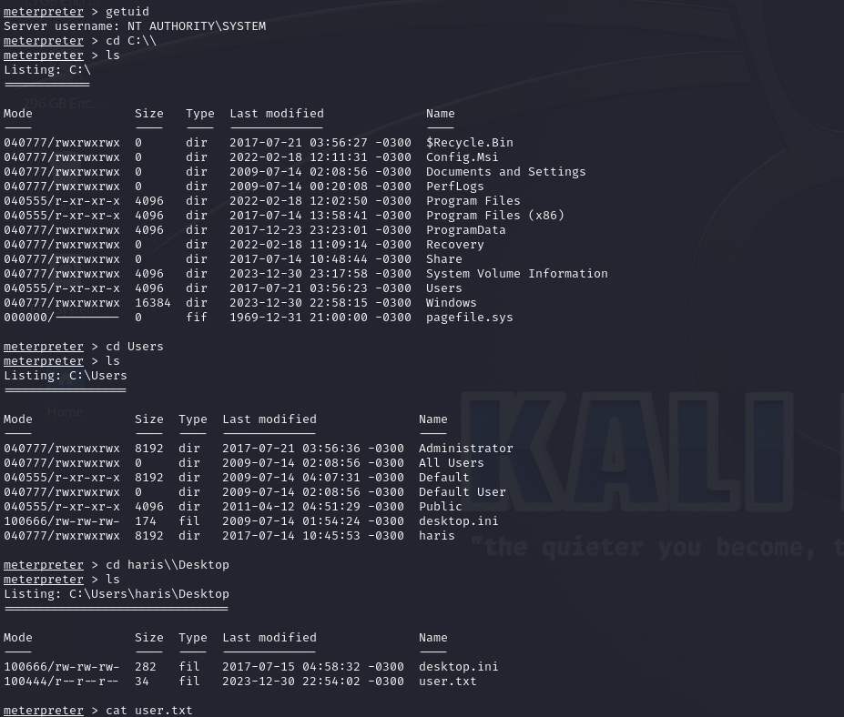
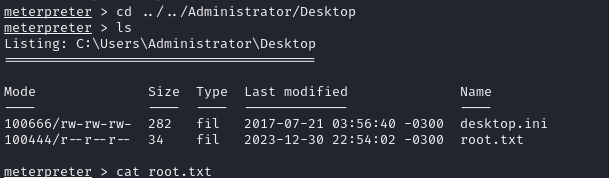

Blue, while possibly the most simple machine on Hack The Box, demonstrates the severity of the EternalBlue exploit, which has been used in multiple large-scale ransomware and crypto-mining attacks since it was leaked publicly.

## Enumeration


### Portscan

Doing a simple nmap scan we can see that the machine have 2 port that works similarly 135 and 445. This are used to share files between computers and networks.
<br>
We can see the host using Windows 7 Professional 6.1, this make potentially vulnerable to eternal blue exploit.

```
──(emnavarro㉿kali)-[~/Documents]
└─$ nmap -sCV 10.10.10.40 -T5    
Starting Nmap 7.94SVN ( https://nmap.org ) at 2023-12-30 23:14 -03
Warning: 10.10.10.40 giving up on port because retransmission cap hit (2).
Stats: 0:01:44 elapsed; 0 hosts completed (1 up), 1 undergoing Connect Scan
Connect Scan Timing: About 82.60% done; ETC: 23:17 (0:00:22 remaining)
Stats: 0:01:44 elapsed; 0 hosts completed (1 up), 1 undergoing Connect Scan
Connect Scan Timing: About 82.70% done; ETC: 23:17 (0:00:22 remaining)
Stats: 0:02:05 elapsed; 0 hosts completed (1 up), 1 undergoing Connect Scan
Connect Scan Timing: About 94.83% done; ETC: 23:17 (0:00:07 remaining)
Stats: 0:02:47 elapsed; 0 hosts completed (1 up), 1 undergoing Service Scan
Service scan Timing: About 66.67% done; ETC: 23:17 (0:00:09 remaining)
Nmap scan report for 10.10.10.40
Host is up (0.25s latency).
Not shown: 699 filtered tcp ports (no-response), 298 closed tcp ports (conn-refused)
PORT      STATE SERVICE      VERSION
139/tcp   open  netbios-ssn  Microsoft Windows netbios-ssn
445/tcp   open  microsoft-ds Windows 7 Professional 7601 Service Pack 1 microsoft-ds (workgroup: WORKGROUP)
49152/tcp open  msrpc        Microsoft Windows RPC
Service Info: Host: HARIS-PC; OS: Windows; CPE: cpe:/o:microsoft:windows

Host script results:
| smb2-security-mode: 
|   2:1:0: 
|_    Message signing enabled but not required
| smb2-time: 
|   date: 2023-12-31T02:18:34
|_  start_date: 2023-12-31T01:53:24
| smb-security-mode: 
|   account_used: guest
|   authentication_level: user
|   challenge_response: supported
|_  message_signing: disabled (dangerous, but default)
|_clock-skew: mean: 3s, deviation: 3s, median: 1s
| smb-os-discovery: 
|   OS: Windows 7 Professional 7601 Service Pack 1 (Windows 7 Professional 6.1)
|   OS CPE: cpe:/o:microsoft:windows_7::sp1:professional
|   Computer name: haris-PC
|   NetBIOS computer name: HARIS-PC\x00
|   Workgroup: WORKGROUP\x00
|_  System time: 2023-12-31T02:18:38+00:00

Service detection performed. Please report any incorrect results at https://nmap.org/submit/ .
Nmap done: 1 IP address (1 host up) scanned in 232.46 seconds


```

### Eternal blue scanner

```
msf6 auxiliary(scanner/smb/smb_ms17_010) > options

Module options (auxiliary/scanner/smb/smb_ms17_010):

   Name         Current Setting                                                              Required  Description
   ----         ---------------                                                              --------  -----------
   CHECK_ARCH   true                                                                         no        Check for architecture on vulnerable hosts
   CHECK_DOPU   true                                                                         no        Check for DOUBLEPULSAR on vulnerable hosts
   CHECK_PIPE   false                                                                        no        Check for named pipe on vulnerable hosts
   NAMED_PIPES  /opt/metasploit-framework/embedded/framework/data/wordlists/named_pipes.txt  yes       List of named pipes to check
   RHOSTS                                                                                    yes       The target host(s), see https://docs.metasploit.com/docs/using-metasploit/basics/using-metasploit.html
   RPORT        445                                                                          yes       The SMB service port (TCP)
   SMBDomain    .                                                                            no        The Windows domain to use for authentication
   SMBPass                                                                                   no        The password for the specified username
   SMBUser                                                                                   no        The username to authenticate as
   THREADS      1                                                                            yes       The number of concurrent threads (max one per host)


View the full module info with the info, or info -d command.

msf6 auxiliary(scanner/smb/smb_ms17_010) > set RHOSTS 10.10.10.40
RHOSTS => 10.10.10.40
msf6 auxiliary(scanner/smb/smb_ms17_010) > run

[+] 10.10.10.40:445       - Host is likely VULNERABLE to MS17-010! - Windows 7 Professional 7601 Service Pack 1 x64 (64-bit)
[*] 10.10.10.40:445       - Scanned 1 of 1 hosts (100% complete)
[*] Auxiliary module execution completed
msf6 auxiliary(scanner/smb/smb_ms17_010) > 

```

## Exploitation

Now that we know that the target is vulnerable to the exploit, we need to configure the windows/smb/ms17_010_eternalblue in metasploit to get a shell.



Using the meterpreter getuid we can see that we have system's privilege, making us able to see all the flags.




